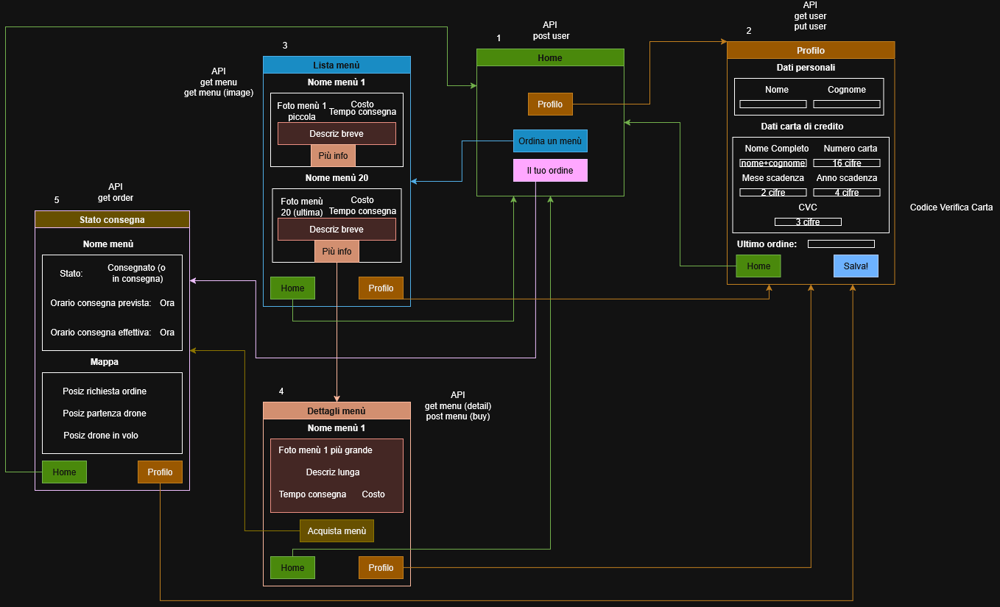

# Mangia e Basta
Progetto realizzato per il corso di Mobile Computing (a.a. 2024/25).

Prototipo di client mobile per Android, sviluppato in React Native ed Expo, per un servizio di food delivery che permette di ordinare menù e seguirne la consegna tramite drone in tempo reale su mappa

<table>
  <tr>
    <td></td>
    <td></td>
  </tr>
  <tr>
    <td></td>
    <td></td>
  </tr>
</table>

## Feature principali
- Registrazione implicita
- Gestione profilo utente
- Lista dei menu
- Dettagli menu
- Visualizzazione della consegna su mappa
- Salvataggio pagina

## Schema di navigazione

## Documentazione
- [Specifica del progetto](docs/SpecificaProgetto.pdf)
- [Documentazione completa](docs/Documentazione.pdf)

## Setup
- Node.js
- Expo CLI
- Visual Studio Code
